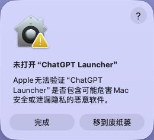
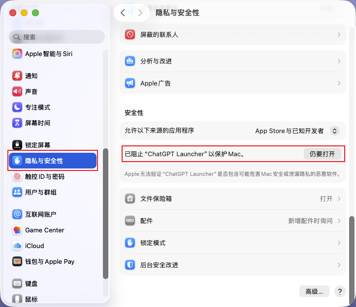
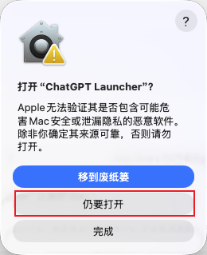
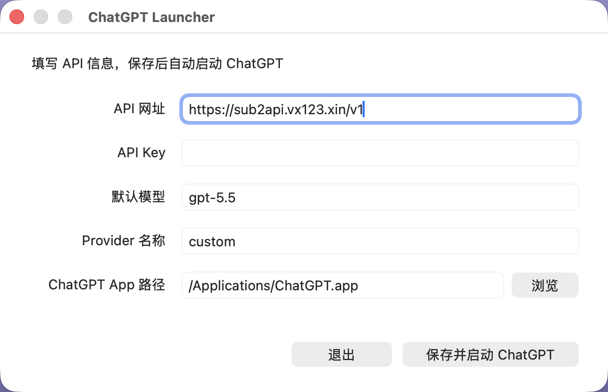

# ChatGPT 便携版使用说明（macOS）

**适用平台：macOS 12 (Monterey) 及以上。** 本说明面向 macOS 便携压缩包，包内含：官方应用安装包 `ChatGPT.dmg`、便携启动器 `ChatGPT Launcher.app`、本使用说明（macOS 版）PDF。Windows 便携版请参考对应说明。首次完成配置后，后续可直接运行启动器使用。

> 安全提示：API 密钥等同于账户凭证。不要将密钥、`config.ini` 或包含密钥的截图发给他人；不再使用时请在供应商后台禁用或删除密钥。

## 一、准备 API 密钥

### 1. 打开 API 密钥页面

登录服务商后台，在左侧选择 **API 密钥**，再点击右上角的 **创建密钥**。

### 2. 填写密钥信息

在“创建密钥”窗口中：

1. 填写一个便于识别的名称，例如“ChatGPT 便携版”。
2. 选择可使用目标模型的分组。
3. 其余限制项按自己的需要设置；不确定时可保持默认。
4. 点击 **创建**。

### 3. 复制并妥善保管密钥

创建后，在密钥列表中点击复制图标。请将密钥立即粘贴到启动器配置中；不要保存到公开文档、聊天记录或代码仓库。

## 二、安装与首次启动

### 4. 安装官方 ChatGPT 应用

启动器需要配合官方 ChatGPT 应用使用。若尚未安装，请打开包内的 `ChatGPT.dmg`，把 **ChatGPT** 拖入“应用程序”文件夹（通常安装为 `/Applications/ChatGPT.app`）。如果 ChatGPT 应用正在运行，请先按 **⌘Q** 完全退出。

### 5. 首次打开：先点“完成”

解压压缩包后双击 `ChatGPT Launcher.app`。由于未经 Apple 公证，会弹出“未打开……Apple 无法验证是否包含恶意软件”。**先点“完成”**（不要点“移到废纸篓”）。

### 6. 在“系统设置”中放行

打开 **系统设置 → 隐私与安全性**，滚动到“安全性”一节，在“已阻止 “ChatGPT Launcher” 以保护 Mac”处点 **“仍要打开”**（可能需要用触控 ID 或密码确认）。

### 7. 确认打开

在弹出的确认框中再次点 **“仍要打开”**。之后双击 `ChatGPT Launcher.app` 就能正常启动，不会再拦截。

### 8. 填写连接信息

首次启动会弹出配置窗口：

1. **API 网址**：填写服务商提供的接口地址，通常以 `/v1` 结尾。
2. **API Key**：粘贴从服务商网站复制的密钥。
3. **默认模型**：填写服务商支持的模型名称，例如截图中的 `gpt-5.5`。
4. **Provider 名称**：一般可保留 `custom`。
5. **ChatGPT App 路径**：启动器会自动检测“应用程序”里的官方应用（如 `/Applications/ChatGPT.app`）；未检测到时点“浏览”手动选择。
6. 点击 **保存并启动 ChatGPT**。

配置会保存到 `~/Library/Application Support/ChatGPT Launcher/config.ini`。该文件包含 API Key，请妥善保管。

### 9. 完成 ChatGPT 首次设置

首次运行 ChatGPT 时，按界面提示选择一个工作类别并继续。若 macOS 请求授予 ChatGPT 一次性权限，请确认发布者后点击“允许”。

### 10. 放入“应用程序”或 Dock

把 `ChatGPT Launcher.app` 拖进“应用程序”文件夹或 Dock。以后单击即可启动，无需重复填写 API 信息（macOS 版不会自动创建桌面图标）。

## 三、日常使用

### 11. 切换工作模式

点击左上角的 **Codex** 下拉菜单，可以在 **ChatGPT Work** 与 **Codex** 之间切换：

- **Codex**：适合编写、调试和审查代码。
- **ChatGPT Work**：适合创建、学习和探索等通用工作。

### 12. 切换模型

在输入框右下角点击当前模型名称，选择所需模型。只有服务商为当前 API Key 所属分组开通的模型才能正常使用。

如果出现“模型不受当前账户组支持”或 `404 Not Found`：

1. 打开模型菜单，改选该分组已开通的模型。
2. 或回到服务商后台，为密钥选择支持目标模型的分组后重新创建密钥。
3. 保存配置并重新启动启动器。

### 13. 开始对话

选择模式和模型后，直接在输入框描述需求即可。对于编程任务，建议同时说明：目标、已有代码/报错、期望输出及限制条件。

## 四、查看用量

登录服务商后台，点击左侧 **使用记录**。页面上方可查看 Token 使用趋势与费用汇总；下方明细表可按 API 密钥、模型、分组等条件筛选，也可按需导出 CSV。

## 五、常见问题

| 现象 | 处理方式 |
| --- | --- |
| 首次打开被 macOS 拦截 | 按“二、安装与首次启动”的第 5–7 步操作：先点“完成”，再到 系统设置 → 隐私与安全性 点“仍要打开”，最后在确认框里再点一次“仍要打开”。 |
| 启动器找不到 ChatGPT App | 在配置窗口点击“浏览”，选择“应用程序”里的官方应用（`ChatGPT.app` / `Codex.app` / `OpenAI Codex.app`）；确认已按第 4 步安装官方应用。 |
| 双击后自动打开了“终端”窗口 | 运行的是未打包的裸可执行文件，请改用 `ChatGPT Launcher.app`。 |
| 提示“App 已损坏，应移到废纸篓” | 压缩包经网络传输被加了隔离标记。在“终端”运行 `xattr -dr com.apple.quarantine "ChatGPT Launcher.app"` 后重试。 |
| 提示 API Key 无效 | 检查是否完整粘贴密钥、密钥是否已禁用，以及 API 地址是否为服务商提供的 `/v1` 地址。 |
| 提示模型不支持或 404 | 当前密钥分组未开通该模型；请切换到可用模型，或调整服务商后台的密钥分组。 |
| 更换 API Key 或接口地址 | 在“终端”运行 `"ChatGPT Launcher.app/Contents/MacOS/chatgpt-launcher" --config`，修改后点击“保存并启动 ChatGPT”。 |
| 想迁移到另一台 Mac | 整体拷贝分发文件夹；迁移前确认目标 Mac 已安装官方 ChatGPT 应用。配置文件在用户目录、不随文件夹迁移，需在新机重新填写。 |
