# ChatGPT 便携版使用说明（Windows）

**适用平台：Windows 10 / 11（64 位）。** 本说明面向包含 `chatgpt-launcher.exe`、`codex_app` 和 `data` 目录的 Windows 便携包；macOS 便携版请参考对应说明。首次完成配置后，后续可直接运行启动器使用。

> 安全提示：API 密钥等同于账户凭证。不要将密钥、`config.ini` 或包含密钥的截图发给他人；不再使用时请在供应商后台禁用或删除密钥。

## 一、准备 API 密钥

### 1. 打开 API 密钥页面

登录服务商后台，在左侧选择 **API 密钥**，再点击右上角的 **创建密钥**。

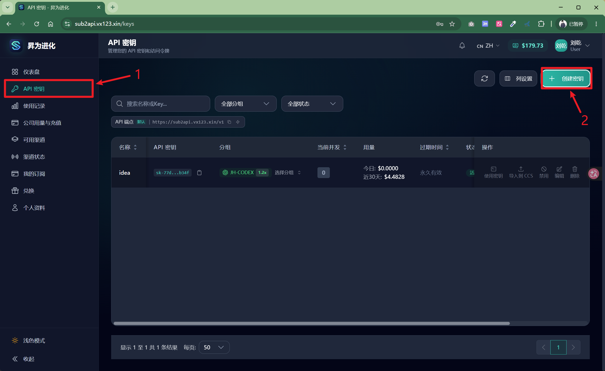

### 2. 填写密钥信息

在“创建密钥”窗口中：

1. 填写一个便于识别的名称，例如“ChatGPT 便携版”。
2. 选择可使用目标模型的分组。
3. 其余限制项按自己的需要设置；不确定时可保持默认。
4. 点击 **创建**。

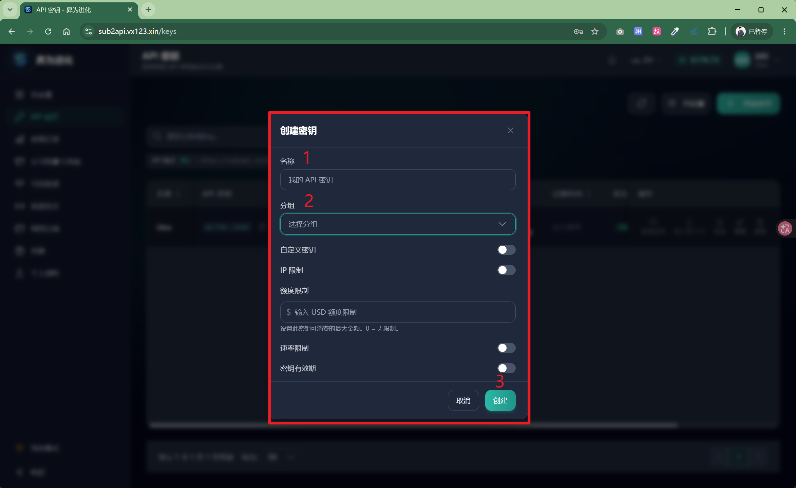

### 3. 复制并妥善保管密钥

创建后，在密钥列表中点击复制图标。请将密钥立即粘贴到启动器配置中；不要保存到公开文档、聊天记录或代码仓库。

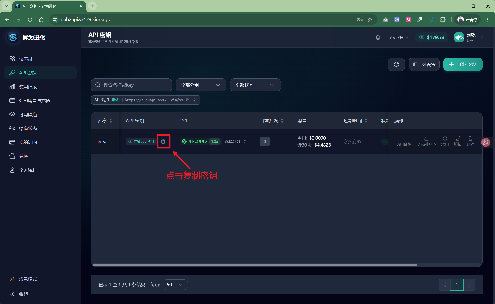

## 二、首次启动与配置

### 4. 运行便携启动器

解压便携包后，双击 **`chatgpt-launcher.exe`** 启动。请保留 `codex_app` 与 `data` 目录，不要只单独移动这个 exe 文件。

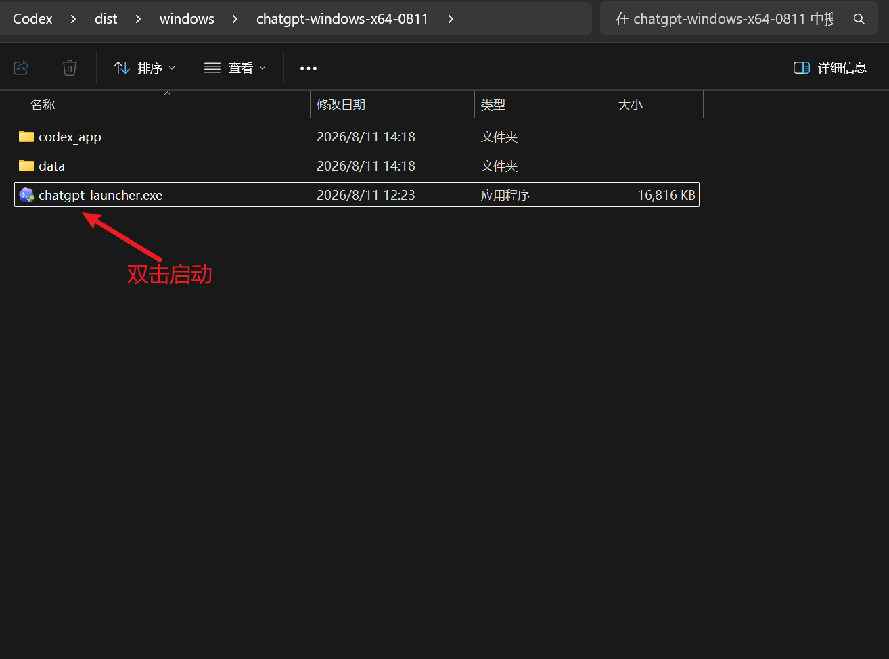

### 5. 填写连接信息

首次启动会显示配置窗口：

1. **API 网址**：填写服务商提供的接口地址，通常以 `/v1` 结尾。
2. **API Key**：粘贴从服务商网站复制的密钥。
3. **默认模型**：填写服务商支持的模型名称，例如截图中的 `gpt-5.5`。
4. **Provider 名称**：一般可保留 `custom`。
5. **ChatGPT App 路径**：启动器会自动检测并填写；未检测到时点击“浏览”手动选择 `Codex.exe` 所在的应用目录。
6. 点击 **保存并启动 ChatGPT**。

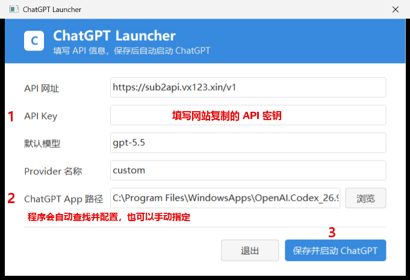

配置会保存到启动器旁的 `config.ini`。该文件包含 API Key，请与启动器目录一并妥善保管。

### 6. 选择工作类别

首次运行 ChatGPT 时，按界面提示选择一个最能描述你工作的类别，然后继续。

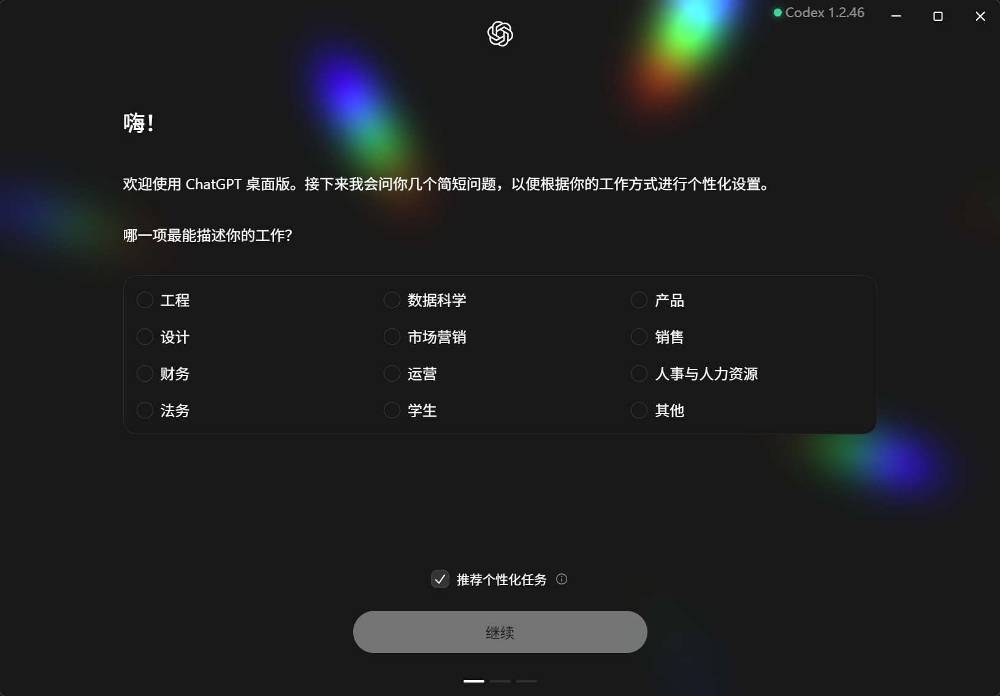

### 7. 完成 Windows 首次设置

若 Windows 请求授予 ChatGPT 一次性权限，请确认发布者为 **OpenAI LLC** 后点击“是”，再点击 **完成设置**。

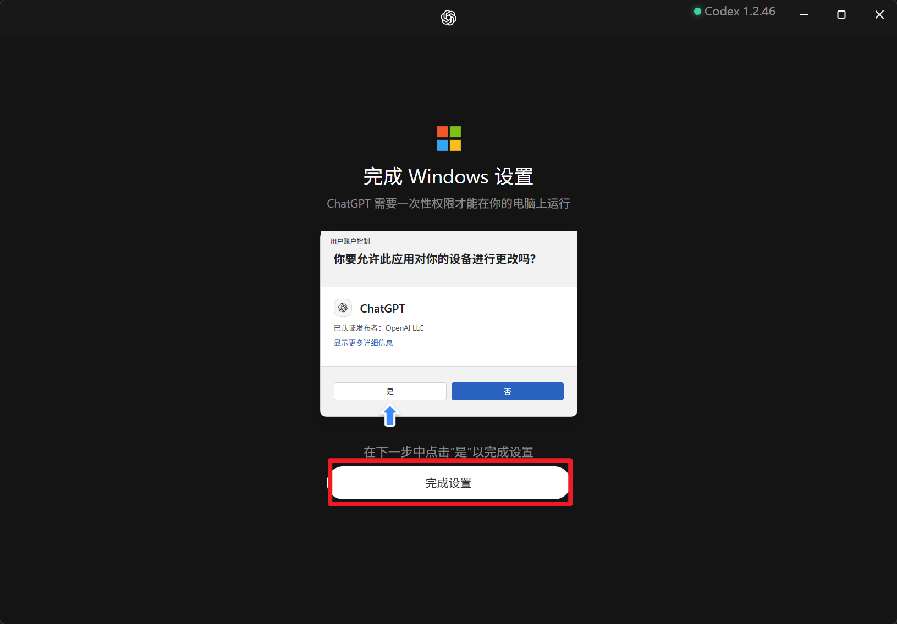

### 8. 使用桌面快捷方式

首次配置并启动成功后，程序会创建 **ChatGPT Launcher** 桌面快捷方式。以后可双击该快捷方式启动，无需重复填写 API 信息。

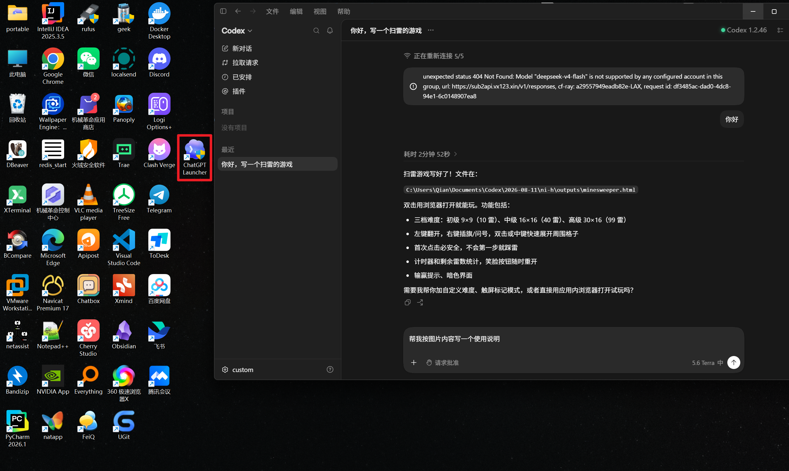

## 三、日常使用

### 9. 切换工作模式

点击左上角的 **Codex** 下拉菜单，可以在 **ChatGPT Work** 与 **Codex** 之间切换：

- **Codex**：适合编写、调试和审查代码。
- **ChatGPT Work**：适合创建、学习和探索等通用工作。

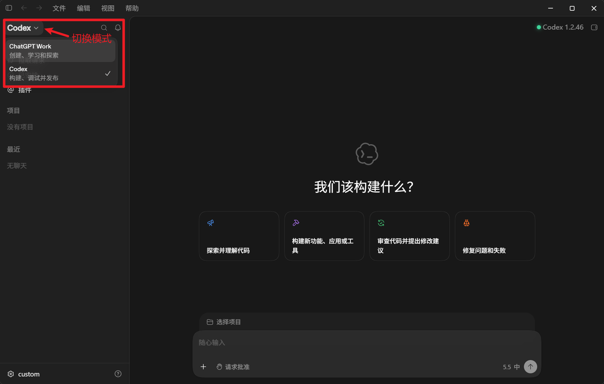

### 10. 切换模型

在输入框右下角点击当前模型名称，选择所需模型。只有服务商为当前 API Key 所属分组开通的模型才能正常使用。

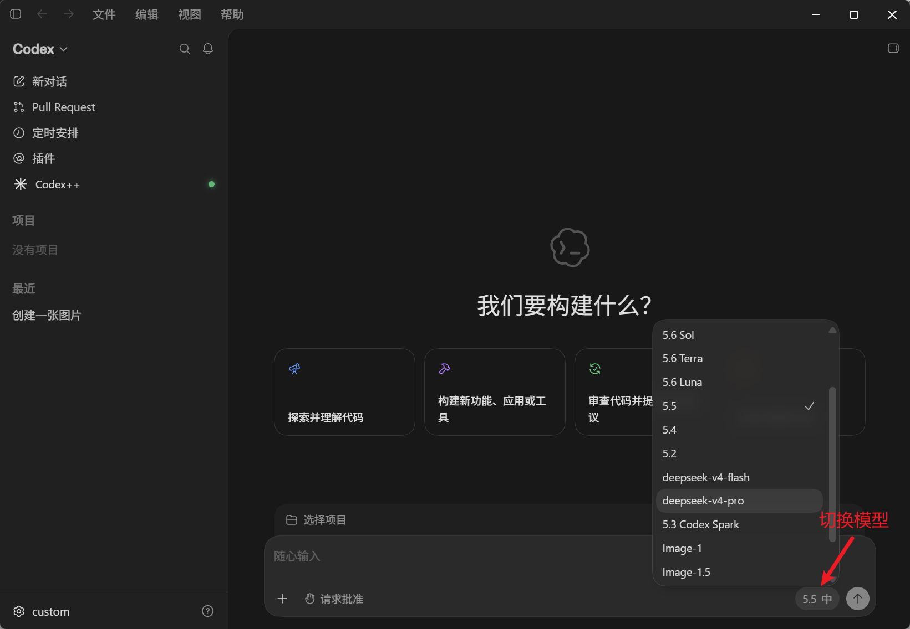

如果出现“模型不受当前账户组支持”或 `404 Not Found`：

1. 打开模型菜单，改选该分组已开通的模型。
2. 或回到服务商后台，为密钥选择支持目标模型的分组后重新创建密钥。
3. 保存配置并重新启动启动器。

### 11. 开始对话

选择模式和模型后，直接在输入框描述需求即可。对于编程任务，建议同时说明：目标、已有代码/报错、期望输出及限制条件。

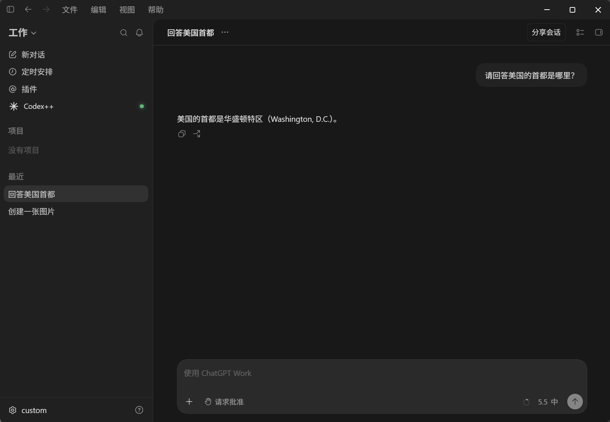

## 四、查看用量

登录服务商后台，点击左侧 **使用记录**。页面上方可查看 Token 使用趋势与费用汇总；下方明细表可按 API 密钥、模型、分组等条件筛选，也可按需导出 CSV。

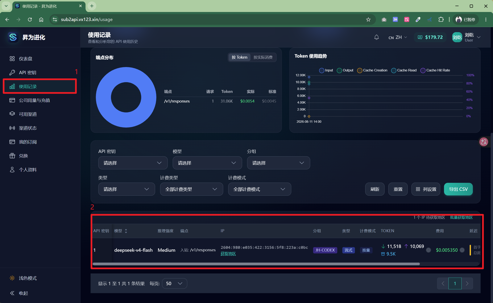

## 五、常见问题

| 现象 | 处理方式 |
| --- | --- |
| 启动器找不到 ChatGPT App | 在首次配置窗口点击“浏览”，选择 `Codex.exe` 所在目录；确认 `codex_app` 没有被删除或移动。 |
| 提示 API Key 无效 | 检查是否完整粘贴密钥、密钥是否已禁用，以及 API 地址是否为服务商提供的 `/v1` 地址。 |
| 提示模型不支持或 404 | 当前密钥分组未开通该模型；请切换到可用模型，或调整服务商后台的密钥分组。 |
| 更换 API Key 或接口地址 | 运行 `chatgpt-launcher.exe --config`，修改后点击“保存并启动 ChatGPT”。 |
| 想迁移到另一台电脑 | 复制整个便携包目录；不要只复制 `chatgpt-launcher.exe`。迁移前确认目标电脑已安装或包含可用的 Codex/ChatGPT App。 |
